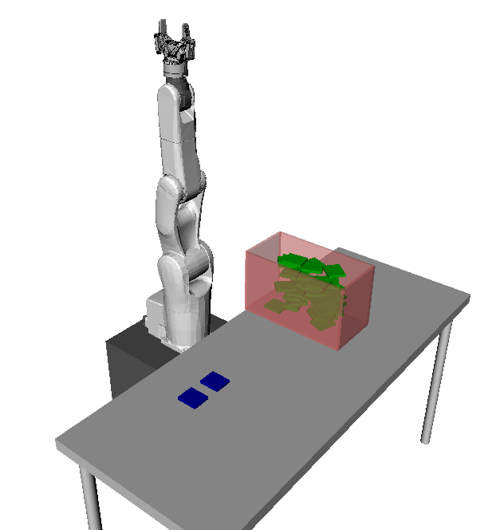



# Motion planning assignment

Prerequisites: Chapters 1, 2, 3.

> #### Exercise::Pick and place
>
First, load the environment, the viewer and the robot (make sure that
you have [installed OpenRAVE](../installation/motion_planning.md),
[cloned the course repository](../installation/basic_tools.md#git), and 
changed directory to $$\texttt{~/catkin_ws/src/osr_course_pkgs/}$$.
>
python
```python
import numpy as np
import openravepy as orpy
env = orpy.Environment()
env.SetViewer('qtcoin')
env.Load('osr_openrave/worlds/pick_and_place.env.xml')
def create_box(T, color = [0, 0.6, 0]):
  box = orpy.RaveCreateKinBody(env, '')
  box.SetName('box')
  box.InitFromBoxes(np.array([[0,0,0,0.035,0.03,0.005]]), True)
  g = box.GetLinks()[0].GetGeometries()[0]
  g.SetAmbientColor(color)
  g.SetDiffuseColor(color)
  box.SetTransform(T)
  env.Add(box,True)
  return box
T = np.eye(4)
container_center = np.array([0.4, 0.2, 0.195])
# Destination
T[:3, 3] = container_center + np.array([0, -0.5, 0])
destination0 = create_box(T, color = [0, 0, 0.6])
T[:3, 3] = container_center + np.array([0, -0.6, 0])
destination1 = create_box(T, color = [0, 0, 0.6])
# Generate random box positions
boxes = []
nbox_per_layer = 2
n_layer = 20
h = container_center[2]
for i in range(n_layer):
  nbox_current_layer = 0
  while nbox_current_layer < nbox_per_layer:
    theta = np.random.rand()*np.pi
    T[0, 0] = np.cos(theta)
    T[0, 1] = -np.sin(theta)
    T[1, 0] = np.sin(theta)
    T[1, 1] = np.cos(theta)
    T[0, 3] = container_center[0] + (np.random.rand()-0.5)*0.2
    T[1, 3] = container_center[1] + (np.random.rand()-0.5)*0.1
    T[2, 3] = h
    box = create_box(T)
    if env.CheckCollision(box):
      env.Remove(box)
    else:
      boxes.append(box)
      nbox_current_layer += 1
  h += 0.011
```
>
Note that we have generated 40 green boxes, on 20 layers, at random
positions and orientations within the container, as shown below:
>

>
### Question 1
>
Write the code to move all the green boxes from the container towards
the blue destination bays. The sequence of motions is as follows:
>
1.  Move the robot to a correct grasping position, i.e. gripper
    perpendicular to the surface of the box, finger pads parallel to
    the edges of the box (you may grasp along either the short or the
    long edges of the box);
2.  Grab the box, using the OpenRAVE function $$\texttt{Grab}$$, see
    Section [Inverse
    kinematics](../kinematics/inverse_kinematics.md#velocity-space-ik). You are
    not required to close the gripper;
3.  Move the box towards one of the blue destination bays and release
    the grasp. Note that the green boxes must be piled up on top of
    the blue bays, with a vertical separation of 1mm between
    two layers. There is no restriction on the number of boxes each
    bay can support;
4.  Start again from step 1.
>
All motions must be collision-free and respect the robot's joint,
velocity, and acceleration limits.
>
### Question 2
>
Compute the angle between the normal to the large surface of the box
and the vertical axis at every time instants. We call the absolute
value of this angle the "tilting angle". For each box, plot the
tilting angle as a function of time, for the whole duration of the
transportation.
>
### Question 3
>
A zero tilting angle corresponds to the situation where the box is
horizontal, which is desired in applications such as liquid
transportation. Write the code to move the green boxes as in Question
1, but with the supplementary constraint that the tilting angle is
always smaller than 1 degrees.
>
If you manage to move all 40 boxes in less than 10 min, computation
time and robot motion time all included, consider sending your code,
together with a written explanation, to <cuong.pham@normalesup.org>.
We shall test your code on our computer, and if it satisfies the
requirements, we'll come back to you for a job interview.
