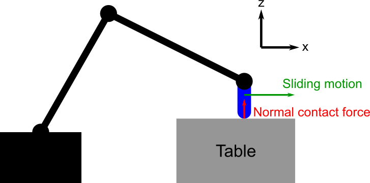
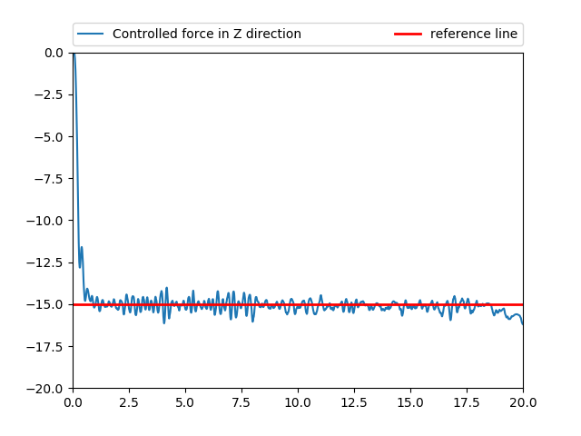



# Examples: hybrid control and impedance control
Hybrid position-force control
=============================

In Section [Principles of force control], we have studied force control
in a 1-DOF robot. In multi-DOF systems, one usually needs to
simultaneously control the force in some task directions and the
position in others, a scheme known as *hybrid position-force control*.
Consider for instance the task of sliding the robot end-effector on a
tabletop (Fig. 1), which can be found in assembly or grinding.



To achieve this task, one needs to control the normal contact force
(along the z-axis) to be at some positive values (for example
$$f_\mathrm{ref}=5\ \mathrm{Newtons}$$), while controlling the position
along the x-axis (sliding motion). This can be achieved by the following
hybrid position-force controller.


The leftmost part of the hybrid scheme is similar to a PD force
controller (see Section [Principles of force control]), which transforms
the *force* tracking error $$f_\mathrm{err}$$ in the z-axis into a
*position* tracking error $$z_\mathrm{err}$$ in the z-axis. Next,
$$z_\mathrm{err}$$ is combined with the position tracking error
$$x_\mathrm{err}$$ in the x-axis to obtain a *task-space* position
tracking error $$(x_\mathrm{err},z_\mathrm{err})$$.

Note that $$x_\mathrm{err}$$ can be easily derived from the desired motion
in the x-axis . For instance, if the desired motion is to slide towards
the right with a velocity $$v_x$$, then $$x_\mathrm{err}:=v_x \delta t$$,
where $$\delta t$$ is the controller time step (assuming a digital
implementation).

Next, the task-space position tracking error is translated into a
configuration-space error by [differential Inverse Kinematics], which
can be finally fed into the robot internal position controller.

> #### Example::Hybrid control in Gazebo
>
We go through the same example as in [Robot simulation in
ROS/Gazebo](../system/simulation.md) in order to pick up the box and
retreat from the table surface. Note however the following differences 
* We use another ROS launch file, which in particular loads different
  controllers, see below;
* We use $$\texttt{JointPositionController}$$ instead of
 $$\texttt{JointTrajectoryController}$$ so as to have real-time access
 to the joint position;
* We use $$\texttt{FTsensor}$$ to access force/torque measurements.
>
First, we start the Gazebo environment in Terminal 1 and run robot
controllers launch file in Terminal 2 
```bash
# Terminal 1
roslaunch osr_gazebo cubes_task.launch
# Terminal 2
roslaunch osr_control controllers_force_control_demo.launch
```
>
Next, run a similar code as in [Robot simulation in
ROS/Gazebo](../system/simulation.md) up to the retreating move
python
``` python
import rospy
import criros
import collections
import copy
import time
import numpy as np
import openravepy as orpy
import tf.transformations as tr
from osr_openrave import kinematics, planning
from geometry_msgs.msg import WrenchStamped
from osr_control.controllers import GripperController, JointPositionController, FTsensor
rospy.init_node('setting')
env = orpy.Environment()
if not env.Load('worlds/cubes_task.env.xml'):
  rospy.logerr('Failed to load the world. Did you run: catkin_make install?')
  exit(1)
env.SetDefaultViewer()
Tcamera = tr.euler_matrix(*np.deg2rad([-120, 13, 135]))
Tcamera[:3,3] = [1, 1, 2]
env.GetViewer().SetCamera(Tcamera)
robot = env.GetRobot('robot')
manipulator = robot.SetActiveManipulator('gripper')
robot.SetActiveDOFs(manipulator.GetArmIndices())
taskmanip = orpy.interfaces.TaskManipulation(robot)
js_rate = criros.utils.read_parameter('/joint_state_controller/publish_rate', 250.0) #read publish rate if it does exist, otherwise set publish rate
T = 1. / js_rate
rate = rospy.Rate(js_rate)
# Scale down the velocity and acceleration limits
robot.SetDOFVelocityLimits(robot.GetDOFVelocityLimits()*0.4)
robot.SetDOFAccelerationLimits(robot.GetDOFAccelerationLimits()*0.2)
iktype = orpy.IkParameterization.Type.Transform6D
success = kinematics.load_ikfast(robot, iktype)
if not success:
  rospy.logerr('Failed to load IKFast for {0}, manipulator: {1}'.format(robot.GetName(), manipulator.GetName()))
  IPython.embed()
  exit(1)
# Load links stats for finding closest IK solutions
statsmodel = orpy.databases.linkstatistics.LinkStatisticsModel(robot)
if not statsmodel.load():
  rospy.loginfo('Generating LinkStatistics database. It will take around 1 minute...')
  statsmodel.autogenerate()
statsmodel.setRobotWeights()
statsmodel.setRobotResolutions(xyzdelta=0.01)
joint_controller = JointPositionController()
gripper_controller = GripperController()
ft_sensor = FTsensor()
cube = env.GetKinBody('cube02')
cube_centroid = cube.ComputeAABB().pos()
Tgrasp = tr.euler_matrix(0, np.pi, 0)
Tgrasp[:3,3] = cube_centroid
qgrasp = kinematics.find_closest_iksolution(robot, Tgrasp, iktype)
axes = []
axes.append( orpy.misc.DrawAxes(env, Tgrasp, dist=0.05) )
traj = planning.plan_to_joint_configuration(robot, qgrasp)
robot.WaitForController(0)
traj_spec = traj.GetConfigurationSpecification()
traj_duration = traj.GetDuration()
step_num = traj_duration // T
#Here we do not use trajectory controller instead we use joint position controller
#It means that we sample many points on the trajectory, which is given by IK fast solver
#Robot will be moving point by point and follow the specified trajectory 
for t in np.append(np.arange(0,traj_duration, T),traj_duration):
  joint_controller.set_joint_positions(list(traj_spec.ExtractJointValues(traj.Sample(t),robot, manipulator.GetArmIndices())))
  robot.SetDOFValues(list(joint_controller.get_joint_positions()), manipulator.GetArmIndices())
  rate.sleep()
gripper_controller.command(0.05)
taskmanip.CloseFingers()
gripper_controller.wait()
robot.WaitForController(0)
robot.Grab(cube)
gripper_controller.grab('{0}::link'.format(cube.GetName()))
Tretreat = np.array(Tgrasp)
Tretreat[2,3] += 0.05
Tretreat[0,3] -= 0.1
axes.append( orpy.misc.DrawAxes(env, Tretreat, dist=0.05) )
qretreat = kinematics.find_closest_iksolution(robot, Tretreat, iktype)
traj = planning.plan_to_joint_configuration(robot, qretreat)
robot.WaitForController(0)
traj_spec = traj.GetConfigurationSpecification()
traj_duration = traj.GetDuration()
step_num = traj_duration // T
for t in np.append(np.arange(0,traj_duration,T),traj_duration):
  joint_controller.set_joint_positions(list(traj_spec.ExtractJointValues(traj.Sample(t), robot, manipulator.GetArmIndices())))
  robot.SetDOFValues(list(joint_controller.get_joint_positions()),manipulator.GetArmIndices())
  rate.sleep()
time.sleep(2)
```
>
Now, move the box down to the table surface until contact
python
``` python
dt = 1. / js_rate
Kf = 5000.
Kp = np.array([1., 1., 1.]) * 1. 
Kv = np.array([1., 1., 1.]) * 40     
Fr = np.array([0., 0., -15])
qc = joint_controller.get_joint_positions()
Fe_prev = np.zeros(3)
xf = np.zeros(3)
dxf = np.zeros(3)
rospy.loginfo('Going down')
wrench_offset = ft_sensor.get_filtered_wrench()
link_idx = [l.GetName() for l in robot.GetLinks()].index('robotiq_85_base_link')
link_origin = robot.GetLink('robotiq_85_base_link').GetTransform()[:3,3]
J = np.zeros((6,6))
twist = np.zeros(6)
while not rospy.is_shutdown():
  q_actual = joint_controller.get_joint_positions()
  robot.SetDOFValues(q_actual, manipulator.GetArmIndices())
  We = ft_sensor.get_filtered_wrench() - wrench_offset
  bTe = manipulator.GetEndEffectorTransform()
  bXeF = criros.spalg.force_frame_transform(bTe)
  Wb = np.dot(bXeF, We)
  Fb = -Wb[:3]
  Fr[0:2] = Fb[0:2]
  if np.linalg.norm(Fb) >= np.linalg.norm(Fr):
    rospy.loginfo('Surface contacted, preparing for sliding')
    break
  # Force PD compensator
  Fe = (Fr - Fb) / Kf
  dFe = (Fe - Fe_prev)
  Fe_prev = Fe
  dxf = (Kp*Fe + Kv*dFe) * dt
  xf += dxf
  twist[:3] = dxf
  # Velocity-based operational space controller
  J[:3,:] = robot.ComputeJacobianTranslation(link_idx, link_origin)[:,:6]
  J[3:,:] = robot.ComputeJacobianAxisAngle(link_idx)[:,:6]
  dqc = np.linalg.solve(J, twist)
  qc += dqc
  joint_controller.set_joint_positions(qc)
  rate.sleep()
  # Safety limits: displacement and max force
  if np.linalg.norm(Fb) >= 40.:
    rospy.loginfo('Maximum force exceeded')
    break
time.sleep(2)
```
>
Slide on the surface using hybrid control
python
``` python
vlin = 0.006         #linear velocity
dr_slide = [1.,0.]   # sliding direction on x-y plane
dt = 1./ js_rate  # time step  
x0,y0,z0 = manipulator.GetEndEffectorTransform()[:3,3] #position of gripper at the starting point
xr = [x0,y0,z0]
timeout = 20      
Kp_pos = np.array([1, 1, 0])          #proportional gain of position controller
Kv_pos = np.array([0.05, 0.05, 0])    #derivative gain of position controller
Kp_force = np.array([0, 0, 3.4e-5])   #proportional gain of force controller
Kv_force = np.array([0, 0, 5e-6])     #derivative gain of force controller
bTe = manipulator.GetEndEffectorTransform()
bXeF = criros.spalg.force_frame_transform(bTe) # transformation matrix that convert wrench wrt body frame to  wrench in space frame
wrench_offset = ft_sensor.get_filtered_wrench()
We = ft_sensor.get_filtered_wrench() - wrench_offset
Wb = np.dot(bXeF, We)                 #wrench (the environment inserts on the end effector) is represented in space frame
Fe_prev = -Wb[:3]                     #extract force vector only, negative sign indicates this is the force inserted on the environment by the robot
xe_prev = [x0, y0, z0]
qc = joint_controller.get_joint_positions()
force_data = list()     #data for graph
time_data = list()
initime = rospy.get_time()
link_idx = [l.GetName() for l in robot.GetLinks()].index('robotiq_85_base_link')
link_origin = robot.GetLink('robotiq_85_base_link').GetTransform()[:3,3]
J = np.zeros((6,6))
twist = np.zeros(6)
rospy.loginfo('Sliding')
while not rospy.is_shutdown() and (rospy.get_time() - initime) < timeout:
  xr[0] += dr_slide[0] * vlin * dt
  xr[1] += dr_slide[1] * vlin * dt
  q_actual = joint_controller.get_joint_positions()
  robot.SetDOFValues(q_actual, manipulator.GetArmIndices())
  # Transform wrench to the base_link frame
  We = ft_sensor.get_filtered_wrench() - wrench_offset
  bTe = manipulator.GetEndEffectorTransform()
  bXeF = criros.spalg.force_frame_transform(bTe)
  Wb = np.dot(bXeF, We)
  Fb = -Wb[:3]
  Fr = np.array([0., 0., -15])
  Fr[:2] = Fb[:2]
  Fe = Fr - Fb
  dFe = (Fe - Fe_prev) / dt
  Fe_prev = Fe
  dxf_force = (Kp_force*Fe + Kv_force*dFe) * dt
  xb = manipulator.GetEndEffectorTransform()[:3, 3]
  xe = xr - xb
  dxe = (xe - xe_prev)
  xe_prev = xe
  dxf_pos = (Kp_pos*xe + Kv_pos*dxe) * dt
  dxf = dxf_force + dxf_pos
  twist[:3] = dxf
  # velocity-space IK
  J[:3,:] = robot.ComputeJacobianTranslation(link_idx, link_origin)[:,:6]
  J[3:,:] = robot.ComputeJacobianAxisAngle(link_idx)[:,:6]
  dqc = np.linalg.solve(J, twist)
  qc += dqc
  force_data.append(Fb[2])
  time_data.append(rospy.get_time() - initime)
  joint_controller.set_joint_positions(qc)
  rate.sleep()
rospy.loginfo("Complete hybrid control demo")
```
>
Plot the force data
python
``` python
import matplotlib.pyplot as plt
plt.ion()
plt.plot(time_data,force_data, label = "Force measured in the Z direction")
plt.axhline(y=-15.0, xmin=0, xmax=15., linewidth=2, color = 'r',label = "Reference")
plt.axis([0,20,-20,0])
plt.legend(bbox_to_anchor=(0., 1.02, 1., .102), loc=3,
       ncol=2, mode="expand", borderaxespad=0.)
plt.show()
```

