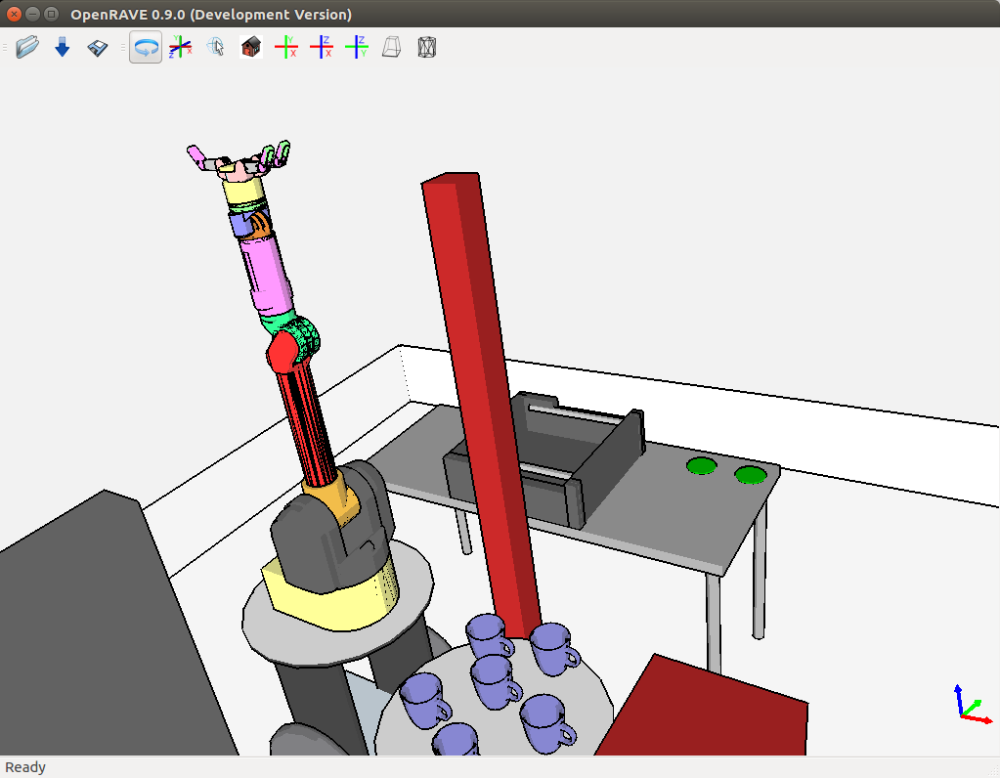

# Motion planning: OpenRAVE

OpenRAVE is one of the most powerful existing simulation and motion planning
environments. It is widely used in academia and industry.

## OpenRAVE installation

At this point, OpenRAVE has a considerable number of dependencies that have to
be installed manually.

## Dependencies

You need to install the following programs:
command-line
```bash
sudo apt-get install build-essential cmake doxygen g++ git ipython octave     \
python-dev python-h5py python-numpy python-pip python-scipy qt5-default       \
minizip
```

Next, you will need to install the following libraries, which are available
from the Ubuntu package repositories:
command-line
```bash
sudo apt-get install ann-tools cmake libann-dev libassimp-dev libavcodec-dev  \
libavformat-dev libboost-python-dev libboost-all-dev libccd-dev               \
libcollada-dom2.4-dp-dev libeigen3-dev libflann-dev liblapack-dev             \
liblog4cxx-dev libminizip-dev liboctave-dev libode-dev libpcre3-dev           \
libqhull-dev libsoqt-dev-common libsoqt4-dev libswscale-dev libtinyxml-dev    \
libxml2-dev octomap-tools
```

## OpenSceneGraph

The version available at the Ubuntu repositories is 3.2, but OpenRAVE uses 3.4,
so we have to build it from source:
command-line
```bash
cd ~/git
git clone https://github.com/openscenegraph/OpenSceneGraph.git --branch OpenSceneGraph-3.4
cd OpenSceneGraph
mkdir build; cd build
cmake .. -DDESIRED_QT_VERSION=4
make -j `nproc`
sudo make install
```

## FCL - The Flexible Collision Library

Build and install `fcl` version 0.5.0:
command-line
```bash
mkdir -p ~/git; cd ~/git
git clone https://github.com/flexible-collision-library/fcl
cd fcl; git checkout 0.5.0
mkdir build; cd build
cmake ..
make -j `nproc`
sudo make install
```

## `sympy` Version

`IKFast` requires `sympy` 0.7.1. To get this version you need to use `pip`:
command-line
```bash
pip install --upgrade --user sympy==0.7.1
```

## Build and install

Now you can build and install OpenRAVE:
command-line
```bash
cd ~/git
git clone https://github.com/rdiankov/openrave.git
cd openrave; git reset --hard 9350ebc
mkdir build; cd build
cmake -DODE_USE_MULTITHREAD=ON -DOSG_DIR=/usr/local/lib64/ ..
make -j `nproc`
sudo make install
```

## Testing the installation

Let's try to run OpenRAVE with an existing environment:
command-line
```bash
openrave data/lab1.env.xml
```


Now you should be able to try some of the [OpenRAVE examples](http://openrave.org/docs/latest_stable/examples/).
