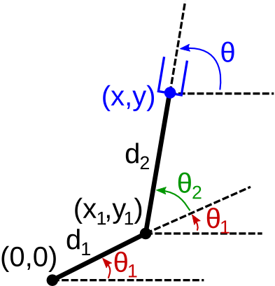



# Forward kinematics

## Introductory example: a planar 2-DOF manipulator

Consider a planar manipulator with two revolute joints, as in Fig. 1.
The joint angles are denoted by $$\bfq:=(\theta_1,\theta_2)$$. The
end-effector is a parallel gripper (in blue). The position and the
orientation of the end-effector are denoted by $$\bfp:=(x,y,\theta)$$. The
*forward kinematics* problem is then to compute the mapping
$$\mathrm{FK}\ : \ \bfq \mapsto \bfp$$.



Applying simple trigonometry on the first link, one has

<center>
$$\left\{\begin{array}{rcl}
x_1 & = & d_1\cos(\theta_1)\\
y_1 & = & d_1\sin(\theta_1)\\
\end{array}\right..$$
</center>

By similar calculations on the second link, one obtains

<center>
$$\left\{\begin{array}{rclcl}
x & = & x_1 + d_2 \cos(\theta_1+\theta_2) & = & d_1\cos(\theta_1) + d_2 \cos(\theta_1+\theta_2)\\
y & = & y_1 + d_2 \sin(\theta_1+\theta_2) & = & d_1\sin(\theta_1) + d_2 \sin(\theta_1+\theta_2)\\
\end{array}\right..$$
</center>

Finally, the orientation of the manipulator is given by $$\theta
= \theta_1 + \theta_2$$.

One has thus obtained the explicit formulae for the forward kinematics
function $$\mathrm{FK}$$.

## Jacobian matrix

Let us now introduce a fundamental object, the Jacobian matrix of the
forward kinematics mapping.

> #### Definition::Jacobian matrix
The Jacobian matrix of the forward kinematics mapping at a given
configuration $$\bfq_0$$ is defined by:
>
<center>
$$\bfJ(\bfq_0) := \left.\frac{\partial\mathrm{FK(\bfq)}}{\partial
\bfq}\right|_{\bfq=\bfq_0}$$
</center>

<br/> <!-- Intentional line-break to cope with markdown limitations   -->

In the case of the planar 2-DOF manipulator, one has

<center>
$$\bfJ(\theta_1,\theta_2) = 
\left(\begin{array}{cc}
\frac{\partial x}{\partial \theta_1} & \frac{\partial x}{\partial
\theta_2}\\
\frac{\partial y}{\partial \theta_1} & \frac{\partial y}{\partial
\theta_2}\\
\frac{\partial \theta}{\partial \theta_1} & \frac{\partial \theta}{\partial
\theta_2}\\
\end{array}\right) =
\left(\begin{array}{cc}
-d_1\sin(\theta_1) - d_2\sin(\theta_1+\theta_2) & -
d_2\sin(\theta_1+\theta_2) \\
d_1\cos(\theta_1) + d_2\cos(\theta_1+\theta_2) & 
d_2\cos(\theta_1+\theta_2) \\
1&1
\end{array}\right).$$
</center>

Remarks:

-   $$\bfJ$$ depends on the joint angles $$(\theta_1,\theta_2)$$;
-   $$\bfJ$$ has as many columns as the number of joint angles (here: 2),
    and as many rows as the number of parameters of the end-effector
    (here: 3).

The Jacobian matrix is useful in that it gives the relationship between
joint angle velocity $$\dot\bfq$$ and the end-effector velocity
$$\dot\bfp$$:

<center>
$$\dot\bfp = \bfJ(\bfq) \dot\bfq.$$
</center>

<br/>

> #### Exercise::FK in Python
Consider a planar 2-DOF manipulator as in Fig. 1, with the following
dimensions $$\texttt{d1=0.1, d2=0.15}$$.
>
1.  Write the Python code of $$\texttt{fk(theta1, theta2)}$$, which
    returns a triple $$\texttt{(x, y, theta)}$$ representing the
    end-effector position and orientation for the joint angles
    $$\texttt{(theta1, theta2)};$$
>	
2.  Write the Python code of $$\texttt{jacobian(theta1, theta2)}$$,
    which returns a matrix $$\texttt{J}$$ representing the Jacobian
    matrix at $$\texttt{(theta1, theta2)};$$
>
3. Assume that $$\texttt{theta1=0.3, theta2=-0.1, delta1=-0.003,
   delta2=0.002}$$. Using the code just written, compute the values
   of:
	-   $$\texttt{fk(theta1, theta2)};$$
	-   $$\texttt{fk(theta1+delta1, theta2+delta2)};$$
	-   $$\texttt{jacobian(theta1, theta2)};$$
	-   $$\texttt{fk(theta1, theta2) +}$$
	$$\texttt{dot(jacobian(theta1, theta2), array([delta1, delta2]))}.$$
>		
What can you conclude?

## Forward kinematics for 3D end-effectors

### Transformation matrices

Usually, the end-effector is a rigid 3D object (rigid body). There are
many ways to represent the *orientations* of rigid bodies: using e.g.
Euler angles, quaternions, or rotation matrices. In this book, we shall
use *rotation matrices*, which have many desirable properties. As a
consequence, the positions/orientations of rigid bodies will be
represented as transformation matrices, which are 4x4 matrices of the
form

<center>
$$\bfT = 
\left(\begin{array}{cccc}
r_{00} & r_{01} & r_{02} & x_0\\
r_{10} & r_{11} & r_{12} & x_1\\
r_{20} & r_{21} & r_{22} & x_2\\
0      & 0      & 0      & 1 
\end{array}\right),$$
</center>

where $$\bfR:=(r_{ij})$$ is a 3x3 rotation matrix representing the
orientation of the rigid body and $$\bfx = (x_0,x_1,x_2)$$ is a vector of
dimension 3 representing its position (or translation) in space. We
shall also note $$\bfT := (\bfR,\bfx)$$.

More precisely, let us attach a rigid *orthonormal frame*
$$(P,\bfu_0,\bfu_1,\bfu_2)$$ to the rigid body, where $$P$$ is the origin of
the body frame and $$\bfu_0,\bfu_1,\bfu_2$$ are three orthonormal vectors.
Then $$(r_{00},r_{10},r_{20})$$, $$(r_{01},r_{11},r_{21})$$,
$$(r_{02},r_{12},r_{22})$$ are the coordinates of respectively
$$\bfu_0,\bfu_1,\bfu_2$$ in the laboratory frame, and $$(x_0,x_1,x_2)$$ are
the coordinates of $$P$$ in the laboratory frame.

The forward kinematics mapping is therefore, in the general case,
$$\mathrm{FK}\ : \ \bfq \mapsto \bfT$$.


#### Composition of transformations

As discussed above, transformation matrices can represent the
position/orientation of a rigid body with respect to the (absolute)
laboratory frame. They can also represent *relative*
position/orientation between two rigid bodies (or two frames). In this
case, one can denote for instance the transformation of frame B with
respect by frame A by $$_A\bfT^B$$.

One can then *compose* transformations. Assume for instance that the
end-effector (a gripper) is grasping a box. If the transformation of the
end-effector with respect to the laboratory is given by
$$_\mathrm{Lab}\bfT^\mathrm{Gri}$$ and that of the box with respect to the
end-effector is given by $$_\mathrm{Gri}\bfT^\mathrm{Box}$$, then the
transformation of the box with respect to the laboratory is given by

<center>
$$_\mathrm{Lab}\bfT^\mathrm{Box} = {_\mathrm{Lab}\bfT^\mathrm{Gri}}
\cdot {_\mathrm{Gri}\bfT^\mathrm{Box}}.$$ 
</center>

### Rigid body velocities

The velocity of a rigid body has two components: linear and angular.
Consider again the *orthonormal frame* $$(P,\bfu_0,\bfu_1,\bfu_2)$$
attached to the rigid body. In this case, the linear velocity is defined
by the velocity of the point $$P$$ in the laboratory frame, that is

<center>
$$
\bfv = \dot\bfx =
\left(\begin{array}{c}
\frac{\d x_0}{\d t}\\
\frac{\d x_1}{\d t}\\
\frac{\d x_2}{\d t}\\
\end{array}\right),
$$
</center>

The angular velocity is defined by the velocity of the rotation of the
vectors $$\bfu_0,\bfu_1,\bfu_2$$, which in turn can be represented by a
vector $$\bfomega$$ of dimension 3. For instance, if the rigid body
is rotating around a fixed axis, then the direction of $$\bfomega$$
is aligned with the axis of rotation and the norm of $$\bfomega$$
is the usual 2D angular velocity.

Given $$(\bfv,\bfomega)$$, the velocity in the laboratory frame of
any point $$Q$$ on the rigid body can be computed as

<center>
$$\bfv_Q = \bfv + \bfomega \times \overrightarrow{PQ}.$$
</center>


#### Relationship between rigid body velocities and transformation matrices

Let us now clarify the relationship between (a) the above definitions of
rigid body velocities and (b) the transformation matrices that represent
the positions/orientations of rigid bodies.

Assume that at time $$t_1$$, the rigid body is at transformation
$$\bfT_1 = (\bfR_1,\bfx_1)$$, and that during a short amount of time
$$\delta t$$, its linear and angular velocities are constant and equal to
$$(\bfv,\bfomega)$$. Then, its transformation
$$\bfT_2 = (\bfR_2,\bfx_2)$$ at time instant $$t_1+\delta t$$ is given by:

<center>
$$\bfx_2 \simeq \bfx_1 + \delta t \cdot \bfv,$$
</center>

<center>
$$\bfR_2 \simeq \exp\left(\delta t \cdot \bfomega^\wedge\right)
\cdot \bfR_1,$$
</center>

where $$\exp$$ denotes the matrix exponential and $$\bfomega^\wedge$$
denotes the matrix that represents a cross product with
$$\bfomega$$

<center>
$$\left(\begin{array}{c}
\omega_0\\
\omega_1\\
\omega_2\\
\end{array}\right)^\wedge :=
\left(\begin{array}{ccc}
0         & -\omega_2 &  \omega_1\\
 \omega_2 & 0         & -\omega_0\\
-\omega_1 &  \omega_0 & 0 
\end{array}\right).$$
</center>


### Linear and angular Jacobians

Jacobian matrices for 3D end-effector can be defined in agreement with
the above definitions of rigid body velocities. Specifically, one can
define the Jacobian for the linear velocity as the $$3 \times n$$ matrix
$$\bfJ_\mathrm{lin}$$ that yields

<center>
$$\bfv = \bfJ_\mathrm{lin}(\bfq) \dot\bfq,$$
</center>

and the Jacobian for the angular velocity as the $$3 \times n$$ matrix
$$\bfJ_\mathrm{ang}$$ that yields1

<center>
$$\mathbf{\omega} = \bfJ_\mathrm{ang}(\bfq) \dot\bfq.$$
</center>

In practice, both matrices $$\bfJ_\mathrm{lin}(\bfq)$$ and
$$\bfJ_\mathrm{ang}(\bfq)$$ can be computed from the robot
structure.

## Forward kinematics in OpenRAVE

Forward kinematics computations are efficiently implemented in OpenRAVE.

### Transformation matrices


> #### Example::FK in OpenRAVE (transformations)
First, load the environment, the viewer and the robot (make sure that
you have [installed OpenRAVE](../installation/motion_planning.md),
[cloned the course repository](../installation/basic_tools.md#git), and 
changed directory to $$\texttt{~/catwin_ws/src/osr_course_pkgs/}$$.
>
python
```python
import openravepy as orpy
env = orpy.Environment()
env.Load('osr_openrave/robots/denso_robotiq_85_gripper.robot.xml')
env.SetDefaultViewer()
robot = env.GetRobot('denso_robotiq_85_gripper')
manipulator = robot.SetActiveManipulator('gripper')
robot.SetActiveDOFs(manipulator.GetArmIndices())
```
>
Now, set the joint angles of the robot to the desired values and print
out the manipulator transforms corresponding to those joint angle
values.
>
python
```python
robot.SetActiveDOFValues([0.1, 0.7, 1.5, -0.5, -0.8, -1.2])
print manipulator.GetEndEffectorTransform()
```
>
output
```
[[ 0.1017798  -0.43477328  0.89476984  0.63417832]
 [ 0.01692568  0.90006731  0.43542206  0.13759824]
 [-0.99466296 -0.02917258  0.0989675   0.43099054]
 [ 0.          0.          0.          1.        ]]
```
>
python
```python
robot.SetActiveDOFValues([0.8, -0.4, 1.5, -0.5, -0.8, -1.2])
print manipulator.GetEndEffectorTransform()
```
>
output
```
[[ 0.64534243 -0.76378161 -0.01306916  0.09756635]
 [ 0.67405755  0.56131544  0.48017851  0.20609597]
 [-0.3594156  -0.31868893  0.87707343  0.95860823]
 [ 0.          0.          0.          1.        ]]
```
>
![OpenRAVE view at configuration [0.8, -0.4, 1.5, -0.5, -0.8,
-1.2].](../assets/kinematics/fk_openrave.png)
>
Note that the robot configuration in the viewer is updated in real
time after each $$\texttt{SetActiveDOFValues}$$ call.


### Jacobian matrices


> #### Example::FK in OpenRAVE (Jacobians)
First, load the environment, the viewer and the Denso robot
>
python
```python
import openravepy as orpy
>
env = orpy.Environment()
env.Load('robots/denso_robotiq_85_gripper.robot.xml')
env.SetDefaultViewer()
robot = env.GetRobot('denso_robotiq_85_gripper')
manipulator = robot.SetActiveManipulator('gripper')
robot.SetActiveDOFs(manipulator.GetArmIndices())
```
>
As the Jacobians depend on the joint angles, one must first set the
joint angles of the robot to the desired values.
>
python
```python
robot.SetActiveDOFValues([0.1, 0.7, 1.5, -0.5, -0.8, -1.2])
```
>
The linear Jacobian is computed by the function
$$\texttt{ComputeJacobianTranslation}$$. This function has two
arguments. The first argument is the link number of the end-effector.
Here, assume that our end-effector is the base of the gripper. To
determine the link number, one can use
>
python
```python
robot.GetLinks()
```
>
output
```
[RaveGetEnvironment(1).GetKinBody('denso_robotiq_85_gripper').GetLink('link0'),
 RaveGetEnvironment(1).GetKinBody('denso_robotiq_85_gripper').GetLink('link1'),
 RaveGetEnvironment(1).GetKinBody('denso_robotiq_85_gripper').GetLink('link2'),
 RaveGetEnvironment(1).GetKinBody('denso_robotiq_85_gripper').GetLink('link3'),
 RaveGetEnvironment(1).GetKinBody('denso_robotiq_85_gripper').GetLink('link4'),
 RaveGetEnvironment(1).GetKinBody('denso_robotiq_85_gripper').GetLink('link5'),
 RaveGetEnvironment(1).GetKinBody('denso_robotiq_85_gripper').GetLink('link6'),
 RaveGetEnvironment(1).GetKinBody('denso_robotiq_85_gripper').GetLink('robotiq_coupler'),
 RaveGetEnvironment(1).GetKinBody('denso_robotiq_85_gripper').GetLink('robotiq_85_base_link'),
 RaveGetEnvironment(1).GetKinBody('denso_robotiq_85_gripper').GetLink('robotiq_85_left_knuckle_link'),
 RaveGetEnvironment(1).GetKinBody('denso_robotiq_85_gripper').GetLink('robotiq_85_right_knuckle_link'),
 RaveGetEnvironment(1).GetKinBody('denso_robotiq_85_gripper').GetLink('robotiq_85_left_finger_link'),
 RaveGetEnvironment(1).GetKinBody('denso_robotiq_85_gripper').GetLink('robotiq_85_right_finger_link'),
 RaveGetEnvironment(1).GetKinBody('denso_robotiq_85_gripper').GetLink('robotiq_85_left_inner_knuckle_link'),
 RaveGetEnvironment(1).GetKinBody('denso_robotiq_85_gripper').GetLink('robotiq_85_right_inner_knuckle_link'),
 RaveGetEnvironment(1).GetKinBody('denso_robotiq_85_gripper').GetLink('robotiq_85_left_finger_tip_link'),
 RaveGetEnvironment(1).GetKinBody('denso_robotiq_85_gripper').GetLink('robotiq_85_right_finger_tip_link')]
```
>
Thus, the gripper base link ($$\texttt{robotiq_85_base_link}$$) is
link number 8.
>
The second argument of $$\texttt{ComputeJacobianTranslation}$$ is
the position in the laboratory frame of the reference point $$P$$ on the
rigid body we mentioned previously. One can choose $$P$$ to be for
instance the origin of the link frame.
>
Putting everything together, we obtain the following code
>
python
```python
link_idx = [l.GetName() for l in robot.GetLinks()].index('robotiq_85_base_link')
link_origin = robot.GetLink('robotiq_85_base_link').GetTransform()[:3,3]
# Improve the visualization settings
import numpy as np
np.set_printoptions(precision=6, suppress=True)
# Print the result
print robot.ComputeJacobianTranslation(link_idx, link_origin)
```
>
output
```
[[-0.076639  0.071775 -0.160337  0.019553  0.018678 -0.        0.      ]
 [ 0.508911  0.007201 -0.016087 -0.044858 -0.022967  0.        0.      ]
 [ 0.       -0.514019 -0.317533  0.020576 -0.067821 -0.        0.      ]]
```
>
The angular Jacobian is computed by the function
$$\texttt{ComputeJacobianAxisAngle}$$. This function has one
argument: the link number of the end-effector.
>
python
```python
print robot.ComputeJacobianAxisAngle(link_idx)
```
>
output
```
[[ 0.       -0.099833 -0.099833  0.804457 -0.368345  0.89477   0.      ]
 [-0.        0.995004  0.995004  0.080715  0.845031  0.435422  0.      ]
 [ 1.        0.        0.       -0.588501 -0.387614  0.098967  0.      ]]
```

### Exercise

> #### Exercise::FK in OpenRAVE
Consider the same Denso robot as previously. Assume that at time
$$t_1$$, we have:
>
- $$\texttt{q1 = [-0.1, 1.8, 1.0, 0.5, 0.2, 1.3]};$$
- $$\texttt{qdot1 = [1.2, -0.7, -1.5, -0.5, 0.8, -1.5]};$$
- $$\texttt{delta_t = 0.1}.$$
>
Questions:
>
1. Compute the transformation matrix of the
   $$\texttt{robotiq_85_base_link}$$ at configurations
   $$\texttt{q1}$$ and $$\texttt{q1 + delta_t*qdot1}$$.
2. Compute the linear and angular Jacobians of the
   $$\texttt{robotiq_85_base_link}$$ at time $$t_1$$.
3. Using these Jacobians, compute another approximation of the
   transformation matrix of the $$\texttt{robotiq_85_base_link}$$
   at time $$\texttt{q_1 + delta_t*qdot_1}$$.
