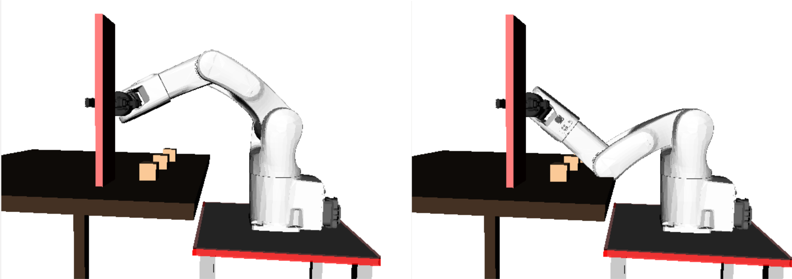



# Inverse kinematics

## Introductory example: a planar 2-DOF manipulator

Consider the same planar 2-DOF manipulator as in Section [Forward
kinematics](forward_kinematics.md). Suppose that we want to place the gripper at a desired
position $$\bfp_\mathrm{des}:=(x_\mathrm{des},y_\mathrm{des})$$ (the
gripper orientation does not matter for now). Finding the appropriate
joint angles $$\bfq^*:=(\theta_1^*,\theta_2^*)$$ that achieve this
position constitutes the *inverse kinematics* problem.

Recall that

<center>
$$\left\{\begin{array}{rcl}
x_\mathrm{des} & = & d_1\cos(\theta_1^*) + d_2 \cos(\theta_1^*+\theta_2^*)\\
y_\mathrm{des} & = & d_1\sin(\theta_1^*) + d_2 \sin(\theta_1^*+\theta_2^*)\\
\end{array}\right..$$
</center>

Squaring both sides of the equations and adding them together yield:

<center>
$$\begin{array}{rcl}
x_\mathrm{des}^2 + y_\mathrm{des}^2 &=& d_1^2 + d_2^2 +
2d_1d_2\left(\cos(\theta_1^*)\cos(\theta_1^*+\theta_2^*) +
\sin(\theta_1^*)\sin(\theta_1^*+\theta_2^*)\right) \\
&=& d_1^2 + d_2^2 + 2d_1d_2 \cos(\theta_2^*).
\end{array}$$
</center>

Thus,

<center>
$$\cos(\theta_2^*) = \frac{x_\mathrm{des}^2+y_\mathrm{des}^2-d_1^2-d_2^2}{2d_1d_2}.$$
</center>

There are two cases:

-   If
    $$\frac{x_\mathrm{des}^2+y_\mathrm{des}^2-d_1^2-d_2^2}{2d_1d_2}>1$$,
    then there are no solutions. Intuitively, this means that the
    desired position for the end-effector is too far away to be reached;
-   Else, there are two solutions for $$\theta_2^*$$:
	<center>
    $$\theta_2^* = \pm \arccos\left( \frac{x_\mathrm{des}^2+y_\mathrm{des}^2-d_1^2-d_2^2}{2d_1d_2} \right)$$
	</center>
	Note that the two solutions correspond to the “elbow up” and
	“elbow down” configurations.


Next, after
[some calculations](http://www.hessmer.org/uploads/RobotArm/Inverse%2520Kinematics%2520for%2520Robot%2520Arm.pdf),
one can find the expression of $$\theta_1^*$$ as:

<center>
$$\theta_1^* =  \arctan2(y_\mathrm{des},x_\mathrm{des}) - \arctan2(k_2,k_1),$$
</center>

where:

<center> 
$$k_1 := d_1 + d_2\cos(\theta_2^*)\quad \mathrm{and} \quad
k_2 := d_2\sin(\theta_2^*).$$
</center>

The above derivations raise the following remarks:

-   Inverse kinematics calculations are in general much more difficult
    than forward kinematics calculations;
-   While a configuration $$\bfq$$ always yields *one* forward kinematics
    solution $$\bfp$$, a given desired end-effector position
    $$\bfp_\mathrm{des}$$ may correspond to zero, one, or multiple
    possible IK solutions $$\bfq^*$$.


> #### Exercise::IK in Python
Consider a planar 2-DOF manipulator as in the figure above, with the following
dimensions $$\texttt{d1=0.1, d2=0.15}$$.
>
1.  Write the Python code for $$\texttt{ik(x_des,y_des)}$$;
2.  Execute $$\texttt{ik(0.1, 0.1)}$$ and $$\texttt{ik(0.1, 0.2)}$$.
    Your code should return respectively 2 and 0 solutions.


## Inverse kinematics for robot manipulators

### Dimensions of the configuration space and of the task space


> #### Definition::Configuration space
In the general case, the set of all possible robot joint angles $$\bfq$$
will be refered to as the *configuration space* of the robot and denoted
$$\mathcal{C}$$. The *dimension* of the configuration space is then the
number of robot joints, which is 6 in the case of the Denso manipulator
considered in this book.

<br/> <!-- Intentional line-break to cope with markdown limitations   -->

> #### Definition::Task space
The task space is defined with respect to the task at hand. Consider for
instance a grasping task. To properly grasp an object, the end-effector
must be placed in a precise 3D position and 3D orientation. In this
case, the task space is the set of all desired 3D
positions/orientations, which has dimension 6 (3 position coordinates
and 3 orientation coordinates). Consider now a drilling task. Here, one
needs to place the tip of the drill bit at the desired hole position (3
position coordinates) and to ensure that the drill bit is perpendicular
to the drilled surface (2 orientation coordinates: the rotation around
the surface normal is irrelevant), yielding a task space of dimension 5.

In general, the dimension of the configuration space must be larger or
equal to the dimension of the task space to ensure the existence of IK
solutions for a significant proportion of desired task values.

### Redundancy


Redundancy arises when there are *multiple IK solutions* for a given
desired task value. Consider the planar 2-DOF manipulator as above. For
the given value $$(x_\mathrm{des},y_\mathrm{des})$$ of the task, there are
two distinct IK solutions, namely $$(\theta_1^*,\theta_2^*)$$ and
$$({\theta'}^*_1,{\theta'}^*_2)$$. For a manipulator with 6 revolute
joints (such as our Denso robot) and a 6D task (position and orientation
of the end-effector), there can exist up to 16 distinct IK solutions for
a given desired position/orientation of the end-effector. This type of
redundancy, when the configuration space and the task space has the same
dimension, can be termed *discrete redundancy*.

Redundancy is more prominent when the dimension of the configuration
space is strictly larger than the dimension of the task space. Consider
again the planar 2-DOF manipulator, but assume now that the task is to
place the gripper on a vertical *line* $$x =
x_\mathrm{des}$$ — the vertical coordinate and the gripper orientation do
not matter. In this case, the task space has dimension 1 (desired values
for $$x_\mathrm{des}$$), and there are an *infinite number of IK
solutions* for each desired value of $$x_\mathrm{des}$$. This type of
redundancy can be termed *continuous redundancy*.


   
### IK computations

#### Task-space analytical IK

We have seen in the IK derivations for a planar 2-DOF manipulator that
the equations are quite complex, involving multiple inverse
trigonometric functions and validity conditions. For general 6-DOF
manipulators and 6D task spaces, which constitute the most common use of
IK, the equations are even more difficult, and there are in general no
closed-form formulae.

#### Velocity-space (or differential) IK

Up to know, we have considered the “task-space” IK problem, that is,
given a desired task value $$\bfp$$, find the configuration $$\bfq$$ so that
$$\mathrm{FK}(\bfq)=\bfp$$. This problem is very difficult since
$$\mathrm{FK}$$ is in general a complex, nonlinear, function, which is
difficult to invert.

Consider now the “velocity-space” (or “differential”) IK problem:
suppose that the robot is at a configuration $$\bfq$$, what joint angle
*velocity* $$\dot\bfq^*$$ will achieve a given a desired task-space
*velocity* $$\dot\bfp_\mathrm{des}$$ (for example, we would like the
end-effector to move with some desired linear and angular velocities)?

This problem is much more tractable than the “task-space IK” problem.
Indeed, from Section [Forward kinematics](forward_kinematics.md), we know that

<center>
$$\dot\bfp = \bfJ(\bfq) \dot\bfq,$$
</center>

which is a *linear* mapping between $$\dot\bfq$$ and $$\dot\bfp$$.

Thus, if the dimensions of the configuration space and task space are
equal (which implies that the Jacobian matrix is square) and that the
Jacobian matrix $$\bfJ(\bfq)$$ is invertible, then $$\dot\bfq^*$$ is simply
given by

<center>
$$\dot\bfq^* = \bfJ(\bfq)^{-1} \dot\bfp_\mathrm{des}.$$
</center>

If the Jacobian matrix $$\bfJ(\bfq)$$ is *not invertible*, then
$$\bfJ(\bfq)$$ is called a *singular* configuration, and should be avoided
when doing velocity-space IK.

If the dimensions of the configuration space is strictly larger than the
dimension of the task space (*redundant* case), then the linear equation

<center>
$$\dot\bfp_\mathrm{des} = \bfJ(\bfq) \dot\bfq^*$$
</center>

has multiple solutions $$\dot\bfq^*$$. In such a case, one may choose
$$\dot\bfq^*$$ to *optimize* some other criteria. For instance, if one is
interested in the smallest joint angle velocity, then one may choose

<center>
$$\dot\bfq^* = \bfJ(\bfq)^{+} \dot\bfp_\mathrm{des},$$
</center>

where $$\bfJ(\bfq)^{+}$$ is the *pseudo-inverse* of $$\bfJ(\bfq)$$.

#### Task-space IK using velocity-space IK

One can use velocity-space IK to find approximate task-space IK
solutions as follows

1.  Start from an arbitrary configuration $$\bfq_0$$ and compute the
    forward kinematics $$\bfp_0 := \mathrm{FK}(\bfq_0)$$;
2.  Choose a path in the task space between $$\bfp_0$$ and
    $$\bfp_\mathrm{des}$$, for instance a straight line;
3.  Divide that path into small chunks $$[\bfp_0,\bfp_1], \dots,
    [\bfp_{n-1},\bfp_n]$$ with $$\bfp_n := \bfp_\mathrm{des}$$;
4.  Using velocity-space IK, compute iteratively:

    -   $$\bfq_1 := \bfq_0 + \bfJ(\bfq_0)^{-1} (\bfp_1 -
        \bfp_0)$$
    -   $$\ \ \vdots$$
    -   $$\bfq_n := \bfq_{n-1} + \bfJ(\bfq_{n-1})^{-1} (\bfp_n -
        \bfp_{n-1})$$

    If the path chunks are small enough, then one should have
    $$\mathrm{FK}(\bfq_1)\simeq
    \bfp_1, \dots, \mathrm{FK}(\bfq_n)\simeq \bfp_n = \bfp_\mathrm{des}$$.

The above scheme is easy to implement but has some drawbacks:

-   For good approximation accuracy, one may need to divide the
    task-space path into many small chunks, which increases computation
    time;
-   The scheme fails if the path $$\bfq_1,\dots,\bfq_n$$ goes near a
    *singularity* in the configuration space;
-   In the *discrete redundancy* case, this scheme can, in general, only
    generate *one* task-space IK solution;
-   The choice of the initial configuration $$\bfq_0$$ affects the IK
    solution that is eventually found.


## Inverse kinematics in OpenRAVE

### Task-space analytical IK: IKFast

As mentioned previously, there is in general no closed-form formulae for
task-space analytical IK. Thus, most of existing IK solvers are based on
the velocity-space IK scheme just presented. The IK solver implemented
in OpenRAVE, IKFast, takes a different approach. Given a robot kinematic
model, IKFast automatically generates, in an *offline stage*, a
*program* that can compute numerical task-space IK solutions. This
program generation can take up to several minutes. At *runtime*, given a
desired task value $$\bfp_\mathrm{des}$$, the program will be executed on
this value, and computation times at this stage are extremely fast. The
advantages of IKFast are

-   It is fast and accurate (several magnitude faster than
    velocity-space IK schemes);
-   In the *discrete redundancy* case, it can give *all* IK solutions,
    not just one. This is particularly important since choosing a “good”
    IK solution can dramatically simplify the subsequent motion planning
    problem.


> #### Example::6D IK with OpenRAVE’s IKFast
First, load the environment, the viewer and the robot (make sure that
you have [installed OpenRAVE](../installation/motion_planning.md),
[cloned the course repository](../installation/basic_tools.md#git), and 
changed directory to $$\texttt{~/catkin_ws/src/osr_course_pkgs/}$$.
>
python
``` python
import numpy as np
import openravepy as orpy
import tf.transformations as tr
env = orpy.Environment()
env.Load('osr_openrave/worlds/cubes_task.env.xml')
env.SetDefaultViewer()
robot = env.GetRobot('robot')
manipulator = robot.SetActiveManipulator('gripper')
robot.SetActiveDOFs(manipulator.GetArmIndices())
np.set_printoptions(precision=6, suppress=True)
# Box to ilustrate elbow up/down
with env:
  box = orpy.RaveCreateKinBody(env, '')
  box.SetName('box')
  box.InitFromBoxes(np.array([[0.5, 0.3, 1, 0.01, 0.04, 0.22]]), True)
  env.AddKinBody(box)
```
>
To grasp the red box on the table, one needs to move the gripper
towards the following position
>
python
``` python
box_centroid = box.ComputeAABB().pos()
print box_centroid
```
output
```
[ 0.5  0.3   1.]
```
>
For this, one can do as follows
>
python
``` python
ikmodel = orpy.databases.inversekinematics.InverseKinematicsModel(robot, iktype=orpy.IkParameterization.Type.Transform6D)
if not ikmodel.load():
  ikmodel.autogenerate()
Tgrasp = tr.quaternion_matrix([ 0.5,  0.5,  0.5, -0.5])
Tgrasp[:3,3] = box_centroid
solutions = manipulator.FindIKSolutions(Tgrasp, 0)
print solutions
```
>
output
```
[[ 0.170333  2.002192 -1.09442   4.606915 -1.436798 -2.471484]
 [ 0.170333  0.884552  1.161062 -1.492324 -1.41946   2.660823]
 [ 0.170333  0.884552  1.161062 -4.633916  1.41946  -0.48077 ]
 [ 0.170333  2.002192 -1.09442   1.465323  1.436798  0.670108]
 [ 0.170333  0.884552  1.161062  1.649269  1.41946  -0.48077 ]
 [ 0.170333  2.002192 -1.09442  -1.67627  -1.436798 -2.471484]]
```
>
The first four lines initialize the IK solver and set the desired
manipulator transform $$\texttt{Tgrasp}$$. Next, the IK solver is
called by $$\texttt{manipulator.FindIKSolutions}$$, which takes two
arguments. The first argument is the desired manipulator transform.
The second argument is a flag that filters the solutions. A flag value
of 0 makes the algorithm return all solutions. Here, one can see that
there are six possible solutions.
>
To check out, for example, solutions number 4 and number 0, one can do
(see figure below)
>
python
``` python
robot.SetActiveDOFValues(solutions[4])
robot.SetActiveDOFValues(solutions[0])
```
>

>
If one wishes to consider only IK solutions that are collision-free,
one can use
>
python
``` python
solutions = manipulator.FindIKSolutions(Tgrasp, orpy.IkFilterOptions.CheckEnvCollisions)
print solutions
```
>
output
```
[[ 0.170333  0.884552  1.161062  1.649269  1.41946  -0.48077 ]
 [ 0.170333  0.884552  1.161062 -1.492324 -1.41946   2.660823]
 [ 0.170333  0.884552  1.161062 -4.633916  1.41946  -0.48077 ]]
```

### Velocity-space IK

> #### Example::Velocity-space IK with OpenRAVE
Velocity-space (or differential) IK is typically used to continuously
move the manipulator following some task-space constraints. Consider
the scenario in the previous example, where the object has been grasped. Suppose that
we would like to move the object upwards by 10 cm, without changing
its orientation. This can be achieved by constraining the translation
velocity of the manipulator to be aligned with the Z-axis and the
rotation velocity of the manipulator to be 0.
>
First, load the environment and set the robot to the grasping
configuration
>
python
``` python
import numpy as np
import openravepy as orpy
>
env = orpy.Environment()
env.Load('worlds/cubes_task.env.xml')
env.SetDefaultViewer()
robot = env.GetRobot('robot')
manipulator = robot.SetActiveManipulator('gripper')
robot.SetActiveDOFs(manipulator.GetArmIndices())
np.set_printoptions(precision=6, suppress=True)
# Working box
with env:
  box = orpy.RaveCreateKinBody(env, '')
  box.SetName('box')
  box.InitFromBoxes(np.array([[0.5, 0.3, 1, 0.01, 0.04, 0.22]]), True)
  env.AddKinBody(box)
>
qgrasp = [0.170333, 0.884552, 1.161062, 1.649269, 1.41946, -0.48077 ]
robot.SetActiveDOFValues(qgrasp)
# Close the gripper and grab the box
taskmanip = orpy.interfaces.TaskManipulation(robot)
taskmanip.CloseFingers()
robot.WaitForController(0)
robot.Grab(box)
```
>
The last command makes the box stick to the end-effector of the robot,
mimicking a grasping behavior.
>
Consider now the following 6D velocity vector
>
python
``` python
twist = np.array([0, 0, 0.01, 0, 0, 0])
```
>
The first three coordinates are the desired translation in each step,
which is 0 in X, 0 in Y and 1 cm in Z. The last three coordinates are
the desired rotation in each step, which is 0.
>
We can now perform the differential IK as follows
>
python
``` python
link_idx = [l.GetName() for l in robot.GetLinks()].index('robotiq_85_base_link')
link_origin = robot.GetLink('robotiq_85_base_link').GetTransform()[:3,3]
J = np.zeros((6,6))
q = robot.GetActiveDOFValues()
for i in range(10):
  J[:3,:] = robot.ComputeJacobianTranslation(link_idx, link_origin)[:,:6]
  J[3:,:] = robot.ComputeJacobianAxisAngle(link_idx)[:,:6]
  qdot = np.linalg.solve(J, twist)
  q[:6] += qdot
  robot.SetDOFValues(q)
  raw_input('Press Enter for next differential IK step')
```
>


<br/> <!-- Intentional line-break to cope with markdown limitations   -->

> #### Exercise::Task-space IK using velocity-space IK
Implement the scheme described in section “Task-space IK using
velocity-space IK” and compare with IK Fast in terms of
>
-   computation time;
-   accuracy of the IK solution.

# To learn more about this topic

See Chapter 6 of

Lynch, K. M., & Park, F. C. (2017). *Modern Robotics: Mechanics,
Planning, and Control*. Cambridge University Press. Available at
http://modernrobotics.org


