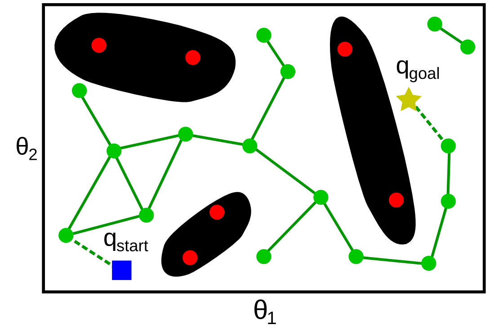



# Path planning

There exists a large variety of approaches to path planning:
combinatorial methods, potential field methods, sampling-based methods,
etc. Sampling-based methods are the most efficient and robust, hence
probably the most widely used for path planning in practice.
Sampling-based methods include Grid Search, Probabilistic Roadmap (PRM)
and Rapidly-exploring Random Trees (RRT), which are presented in the
next two sections.

# Grid Search and Probabilistic Roadmap (PRM)

A first category of sampling-based methods requires building, in a
preprocessing stage, a roadmap that captures the connectivity of
$$\mathcal{C}_\mathrm{free}$$. A roadmap is a graph *G* whose vertices are
configurations of $$\mathcal{C}_\mathrm{free}$$. Two vertices are
connected in *G* only if it is possible to connect the two
configurations by a path entirely contained in
$$\mathcal{C}_\mathrm{free}$$. Once such a roadmap is built, it is easy to
answer the path planning problem: if

1. $$\bfq_\mathrm{start}$$ can be connected to a (nearby) vertex *u*;
2. $$\bfq_\mathrm{goal}$$ can be connected to a (nearby) vertex *v*;
3. *u* and *v* are in the same connected component of *G* (in the
    graph-theoretic sense),

then there exists a collision-free path between $$\bfq_\mathrm{start}$$
and $$\bfq_\mathrm{goal}$$ (see figure below).

Methods for building the roadmap fall into two families: deterministic
or probabilistic. A typical deterministic method is the Grid Search,
where the configuration space $$\mathcal{C}$$ is sampled following a
regular grid, as in the figure below. A sampled configuration is rejected if it is
not in $$\mathcal{C}_\mathrm{free}$$. Next, one attempts to connect every
pair of adjacent configurations (adjacent in the sense of the grid
structure) to each other: if the straight segment connecting the two
configurations is contained within $$\mathcal{C}_\mathrm{free}$$, then the
corresponding edge is added to the graph *G*.

To check whether a segment is contained within
$$\mathcal{C}_\mathrm{free}$$, one may sample many points along the
segment and check whether all those points are in
$$\mathcal{C}_\mathrm{free}$$.


In the Probabilistic Roadmap method, instead of following a regular
grid, samples are taken at random in $$\mathcal{C}_\mathrm{free}$$, see
figure below. Since there is no a priori grid structure, several methods exist
for choosing the pairs of vertices for which connection is attempted:
for instance, one may attempt, for each vertex, to connect it to every
vertices that are within a specified radius *r* from it.




## Strengths of roadmap-based methods

The strength of the roadmap-based methods (both deterministic and
probabilistic) comes from the global/local decomposition – the difficult
problem of path planning is solved at two scales: the local scale, where
neighboring configurations (adjacent configurations in Grid Search,
configurations within a small distance *r* of each other in the
Probabilistic Roadmap) are connected by a simple straight segment; and
the global scale, where the graph search takes care of the global,
complex connectivity of the free space.

Note also that it is not necessary for these methods to have an explicit
representation of $$\mathcal{C}_\mathrm{free}$$: one only needs an oracle
which says whether a given configuration is in
$$\mathcal{C}_\mathrm{free}$$. To check whether a straight segment is
contained within $$\mathcal{C}_\mathrm{free}$$, it suffices to call the
oracle on every configuration (or, in practice, on sufficiently densely
sampled configurations) along that segment.

These methods also possess nice theoretical guarantees. Specifically, it
can be shown that the Grid Search is resolution complete, which means
that if a solution exists, the algorithm will find it in finite time and
for a sufficiently small grid size. Similarly, it can be shown that the
Probabilistic Roadmap method is probabilistically complete, which means
that, if a solution exists, the probability that the algorithm will find
it converges to 1 as the number of sample points goes to infinity.
However, the converge rate of both methods is difficult to determine on
practical problem instances.

Regarding the comparative performances of the deterministic and
probabilistic approaches, it has been shown both theoretically and
practically that randomness is not advantageous in terms of search time.
However, it can be argued that probabilistic methods are easier to
implement.

> #### Exercise::Solving a 2D motion planning problem by PRM
>
First, load a simple 2D environment (make sure that you have [cloned the course repository](../installation/basic_tools.md#git), and 
changed directory to $$\texttt{~/catkin_ws/src/osr_course_pkgs/}$$. 
>
python
```python
import numpy as np
import pylab as pl
import sys
sys.path.append('osr_examples/scripts/')
import environment_2d
pl.ion()
np.random.seed(4)
env = environment_2d.Environment(10, 6, 5)
pl.clf()
env.plot()
q = env.random_query()
if q is not None:
  x_start, y_start, x_goal, y_goal = q
  env.plot_query(x_start, y_start, x_goal, y_goal)
```
>
This should generate an environment as follows
>

>
Question: Implement the PRM algorithm described earlier to solve this
problem instance. Generate other query instances and environment
instances and test your algorithm.
>
Hint: you may use the function
$$\texttt{env.check_collision(x,y)}$$, which returns
$$\texttt{True}$$ if the point $$\texttt{(x,y)}$$ is contained
within a triangular obstacles, $$\texttt{False}$$ otherwise.

# Rapidly-exploring Random Trees (RRT)

The methods just discussed require building the entire roadmap in the
preprocessing stage before being able to answer any query \[a query
being a pair ($$\bfq_\mathrm{start}$$, $$\bfq_\mathrm{goal}$$) to be
connected\]. In applications where only a single or a limited number of
queries are needed, it may not be worthy to build the whole roadmap.
Single-query methods, such as the Rapidly-exploring Random Trees (RRT),
are much more suited for these applications.

Specifically, RRT iteratively builds a tree (see Algorithm 1), which is
also a roadmap, but which has the property of exploring “optimally” the
free space. The key lies in the `EXTEND`{.sourceCode} function, which
selects the vertex in the tree that is the closest to the randomly
sampled configuration (see Algorithm 2). Thus, the
probability for a vertex in the tree to be selected is proportional to
the size of its Voronoi region, causing the tree to grow preferably
towards previously under-explored regions.

pseudo-code
``` vbscript
'Algorithm: BUILD_RRT
'Input: A starting configuration q_start
'Output: A tree T rooted at q_start
T.INITIALIZE(q_start)
FOR rep = 1 TO maxrep
  q_rand ← RANDOM_CONFIG()
  EXTEND(T, q_rand)
```

pseudo-code
``` vbscript
'Algorithm: EXTEND
'Input: A tree T and a target configuration q_rand
'Effect: Grow T by a new vertex in the direction of q_rand
q_near ← NEAREST_NEIGHBOR(T, q_rand)
IF q_new ← STEER(q_near, q_rand) succeeds THEN
  T.ADD_VERTEX(q_new)
  T.ADD_EDGE([q_near, q_new])
```

Note: $$\texttt{STEER(q_near, q_rand)}$$ attempts making a straight
motion from $$\texttt{q_near}$$ towards $$\texttt{q_rand}$$. Three
cases can happen

1.  $$\texttt{q_rand}$$ is within a given distance $$r$$ of
    $$\texttt{q_near}$$ and $$\texttt{[q_near, q_rand]}$$ is
    collision-free, then $$\texttt{q_rand}$$ is returned as the new
    vertex $$\texttt{q_new}$$;
2.  $$\texttt{q_rand}$$ is farther than a given distance $$r$$ of
    $$\texttt{q_near}$$, and the segment of length $$r$$ from
    $$\texttt{q_near}$$ and in the direction of $$\texttt{q_rand}$$
    is collision-free, then the end of that segment is returned as
    $$\texttt{q_new}$$ (see figure below);
3.  else, $$\texttt{STEER}$$ returns $$\texttt{Failure}$$.

![Illustration for the EXTEND function. The tree is
rooted at the black disk. Red disks and plain segments represent
respectively the vertices and edges that have already been added to the
tree. EXTEND attempts at growing the tree toward a random
configuration q<sub>rand</sub>. For this, q<sub>near</sub> is
chosen as the vertex in the tree that is the closest to
q<sub>rand</sub>. The tree is then grown from
q<sub>near</sub> towards q<sub>rand</sub>, stopping at
q<sub>new</sub>, which is at the specified radius r from
q<sub>near</sub>.](../assets/planning/RRT.png)

Finally, to find a path connecting $$\bfq_\mathrm{start}$$ and
$$\bfq_\mathrm{goal}$$, one can grow simultaneously two RRTs, one rooted
at $$\bfq_\mathrm{start}$$ and the other rooted at $$\bfq_\mathrm{goal}$$,
and attempt to connect the two trees at each iteration. This algorithm
is known as bidirectional RRT. In practice, bidirectional RRT has proved
to be easy to implement, yet extremely efficient and robust: it has been
successfully applied to a large variety of robots and challenging
environments.

> #### Exercise::Solving a 2D motion planning problem by RRT
>
> Implement the RRT algorithm to solve the problem instance of the PRM
> exercise above. Generate other query instances and environment
> instances and test your algorithm. Compare the running times of RRT
> and PRM on single and multiple queries problem instances.

# To learn more about this topic

See Chapters 5 and 6 of

LaValle, S. M. (2006). *Planning algorithms*. Cambridge University
Press. Available at <http://planning.cs.uiuc.edu>
