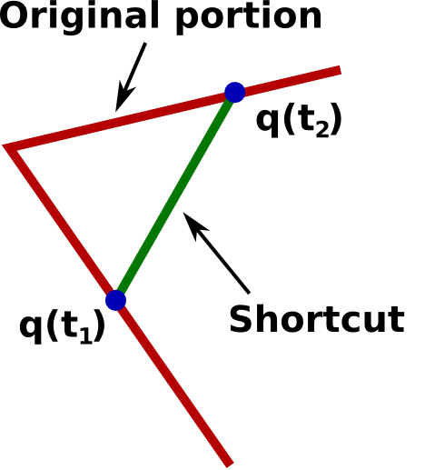
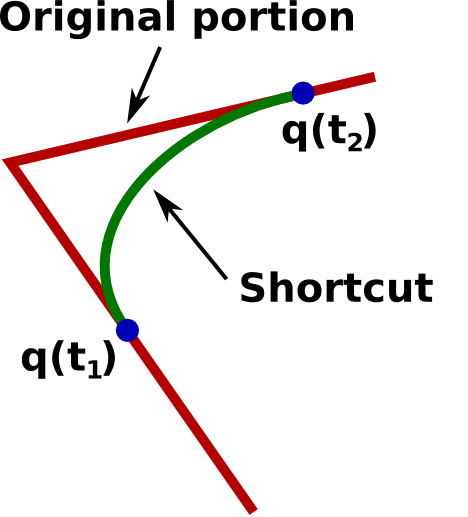
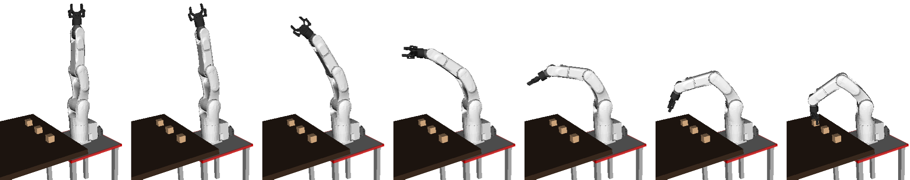
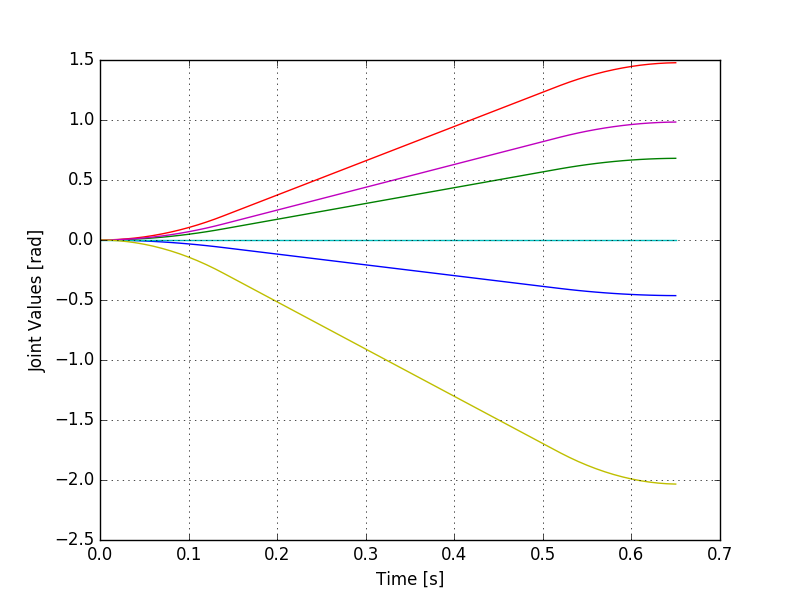



# Post-processing

## Path shortcutting

The paths found by the planning methods of Section [Path
planning](path_planning.md) are collision-free but might not be
optimal in terms of path length. Some planning methods allow finding
optimal paths, such as PRM\* or RRT\*, but they tend to be much slower
and more difficult to implement compared to their non-optimal
counterparts PRM and RRT. An efficient and widely-used approach consists
in *post-processing* the paths found by PRM and RRT to improve the path
quality. The algorithm below shows how to post-process a path by
repeatedly applying *shortcuts*.

pseudo-code
``` vbscript
'Algorithm: PATH_SHORTCUTTING
'Input: A collision-free path q
'Effect: Decrease the path length of q
FOR rep = 1 TO maxrep
  Pick two random points t1, t2 along the path     
  IF the straight segment [q(t1),q(t2)] is collision-free THEN
    Replace original portion by the straight segment
```



> #### Exercise::Post-processing a 2D path
>
Implement in Python the above algorithm to post-process the paths
found in Section [Path planning](path_planning.md).


## Trajectory shortcutting

The same idea as above can be applied to post-process *trajectories*. In
trajectory planning, it is usually required to minimize trajectory
duration.

pseudo-code
``` vbscript
'Algorithm: TRAJECTORY_SHORTCUTTING
'Input: A valid trajectory q
'Effect: Decrease the trajectory duration of q
FOR rep = 1 TO maxrep
  Pick two random points t1, t2 along the trajectory
  Generate a valid shortcut between q(t1) and q(t2) while ensuring velocity continuity
  IF shortcut is collision-free AND has shorter time duration THEN
    Replace original portion by shortcut
```




Note that

-   "Valid" in the above algorithm means "being collision-free and
    respecting the kinodynamic constraints".
-   Usually, in trajectory planning, it is required to ensure the
    continuity of the velocity, which can be achived as follows. The
    initial velocity of the shortcut must be equal to $$\dot\bfq(t_1)$$,
    and the final velocity of the shortcut must be equal to
    $$\dot\bfq(t_2)$$. Thus, the shortcut generation problem can be
    formulated as: find a curve starting from a given *state*
    $$(\bfq_1,\dot\bfq_1)$$ and arriving at a given state
    $$(\bfq_2,\dot\bfq_2)$$, with minimal duration and subject to given
    kinodynamic constraints.

The next two sections present methods to generate such shortcut
candidates, subject to (a) velocity and acceleration bounds, or (b)
general second-order bounds.

### Shortcutting with velocity and acceleration bounds

The problem here can be formulated as follows: given the start and goal
states $$(\bfq_1,\dot\bfq_1)$$ and $$(\bfq_2,\dot\bfq_2)$$, find a curve
$$\bfq(t)_{t\in[0,T]}$$, such that $$\bfq(0) =
\bfq_1, \dot\bfq(0) = \dot\bfq_1, \bfq(T) =
\bfq_2, \dot\bfq(T) = \dot\bfq_2$$, T is minimal and that

<center>
$$\forall t\in[0,T], \forall i\in [1,n], \quad
\left\{\begin{array}{rcl}
|\dot q_i(t)|  &\leq & v_i^{\max} \\
|\ddot q_i(t)| &\leq & a_i^{\max}
\end{array}\right..$$
</center>

In the uni-dimensional case (N = 1), one can find the analytical
expression for the time-optimal interpolant, which corresponds to a
minimum time duration $$T^{\min}$$, see Hauser and Ng-Thow-Hing (2010). In
the multi-dimensional case, one can compute the $$T^{\min}_i$$ for each
dimension i, and choose $$T_{\min}^*:= \max_{i\in[1,N]} T^{\min}_i$$.
Next, one can *re-interpolate* each dimension so that the time duration
of each dimension is $$T_{\min}^*$$. One difficulty here is that the
re-interpolation is not always possible. See Lertkultanon and Pham
(2016) and <https://github.com/Puttichai/parabint> for an algorithm that
can compute the re-interpolation for a large proportion of cases.

### Shortcutting with general second-order bounds

For general second-order (kinodynamic) bounds, there are no analytical
experession for time-optimal interpolants. One possible solution may
consist in

-   generating a smooth curve between $$(\bfq_1,\dot\bfq_1)$$ and
    $$(\bfq_2,\dot\bfq_2)$$, without consideration of kinodynamic bounds;
-   optimally time-parameterizing that curve (using the algorithm
    presented in
    [Time-parameterization](time_parameterization.html#time-parameterization-of-arbitrary-paths-under-general-second-order-bounds))
    so that it respects the kinodynamic bounds.

# Complete motion planning pipeline

The following figure summarizes the complete motion pipeline as presented in this
chapter. This pipeline is widely (if not the only one) used in motion
planning software that are actually deployed on factory shop floors.


## Complete motion planning pipeline in OpenRAVE

OpenRAVE's default planner actually follows exactly the pipeline just
described. The following example shows how to use it on the scenario
discussed at the beginning of this chapter.

> #### Example::Full motion planning pipeline in OpenRAVE
>
Here, we plan a fast, collision-free, motion from the robot initial
configuration towards a configuration that allows grasping a box.
>
First, load the environment, the viewer and the robot (make sure that
you have [installed OpenRAVE](../installation/motion_planning.md),
[cloned the course repository](../installation/basic_tools.md#git), and 
changed directory to $$\texttt{~/catwin_ws/src/osr_course_pkgs/}$$.
>
python
``` python
import numpy as np
import openravepy as orp
env = orpy.Environment()
env.Load('osr_openrave/worlds/cubes_task.env.xml')
env.SetDefaultViewer()
robot = env.GetRobot('robot')
manipulator = robot.SetActiveManipulator('gripper')
robot.SetActiveDOFs(manipulator.GetArmIndices())
qgrasp = [-0.463648, 0.68088 , 1.477533, 0, 0.98318 , -2.034444]
```
>
The last line defines the grasping configuration, which was found
using the IKFast solver (see Section [Inverse
kinematics](../kinematics/inverse_kinematics.md#task-space-analytical-ik-ikfast)).
Now, we can use OpenRAVE's RRT planner
>
python
``` python
# Create the planner
planner = orpy.RaveCreatePlanner(env, 'birrt') # Using bidirectional RRT
params = orpy.Planner.PlannerParameters()
params.SetRobotActiveJoints(robot)
params.SetGoalConfig(qgrasp)
params.SetPostProcessing('ParabolicSmoother', '<_nmaxiterations>40</_nmaxiterations>')
planner.InitPlan(robot, params)
# Plan a trajectory
traj = orpy.RaveCreateTrajectory(env, '')
planner.PlanPath(traj)
# Execute the trajectory
controller = robot.GetController()
controller.SetPath(traj)
```
>
The function $$\texttt{SetPostProcessing}$$ allows fine-tuning the
post-processing, at both the path and trajectory levels. Here, we use
parabolic shortcuts at the trajectory level
($$\texttt{planner="ParabolicSmoother"}$$) and repeat the
shortcutting cycle 40 times
($$\texttt{<_nmaxiterations>40</_nmaxiterations>}$$). Depending on
applications, one can use other types of post-processing (e.g. linear
shortcuts at the path level), increase the number of shortcutting
cycles, etc.
>

>
To access the joint values along the trajectory, one can proceed as
folows
>
python
``` python
times = np.arange(0, traj.GetDuration(), 0.01)
qvect = np.zeros((len(times), robot.GetActiveDOF()))
spec = traj.GetConfigurationSpecification()
for i in range(len(times)):
   trajdata = traj.Sample(times[i])
qvect[i,:] = spec.ExtractJointValues(trajdata, robot, manipulator.GetArmIndices(), 0)
```
>
One can now plot the joint values
>
python
``` python
# Use the OO interface to avoid QT conflicts
from matplotlib.backends.backend_agg import FigureCanvasAgg as FigureCanvas
from matplotlib.figure import Figure
fig = Figure()
canvas = FigureCanvas(fig)
ax = fig.add_subplot(1,1,1)
ax.plot(times, qvect)
ax.grid(True)
ax.set_xlabel('Time [s]')
ax.set_ylabel('Joint Values [rad]')
canvas.print_figure('joint_values.png')
```
>



## To learn more about this topic

- Geraerts, R., & Overmars, M. H. (2007). Creating high-quality paths for
motion planning. *The International Journal of Robotics Research*,
26(8), 845-863.

- Hauser, K., & Ng-Thow-Hing, V. (2010). Fast smoothing of manipulator
trajectories using optimal bounded-acceleration shortcuts. In Robotics
and Automation (ICRA), 2010 IEEE International Conference on (pp.
2493-2498). IEEE.

- Pham, Q. C. (2015). Trajectory Planning. In *Handbook of Manufacturing
Engineering and Technology* (pp. 1873-1887). Springer London.

- Lertkultanon, P., & Pham, Q. C. (2016). Time-optimal parabolic
interpolation with velocity, acceleration, and minimum-switch-time
constraints. *Advanced Robotics*, 30(17), 1095-1110.
