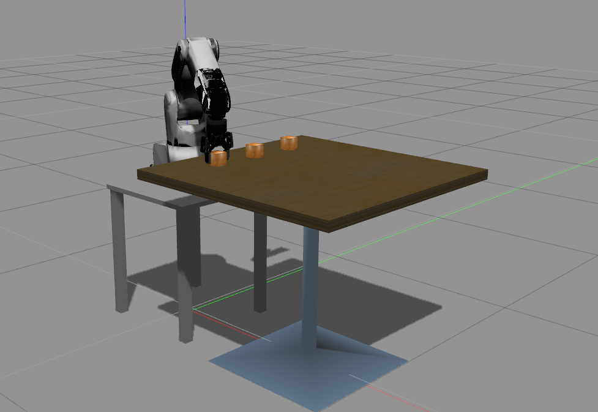

# Robot simulation in ROS/Gazebo

The usual pipeline to make a robot move is as follows
1. Plan a trajectory in OpenRAVE;
2. Convert the OpenRAVE trajectory to a ROS trajectory;
3. Send the ROS trajectory to the robot controller;
4. The robot controller moves the robot joints to the desired joint values at
the desired time instants, as specified by the trajectory, using its own
control algorithms, which are usually not accessible to the end user.


Note that it is also possible to send joint values for one time instant at a
time. More details on this mode of operation will be given later.

In many situations, it is desirable to *simulate* the robot motion in software,
instead of executing it on the hardware. For that, in step 3 of the pipeline,
one can send the trajectory to a *simulated* controller in Gazebo. A key
implementation feature here is that the code to move the simulated robot and
that to move the real one should be the same. This is achieved by appropriate
code abstraction mechanisms.

The following example shows the full pipeline (with execution in Gazebo) for a
motion to grasp a cube on a table.


> #### Example::Robot simulation in ROS/Gazebo
>
First, start the Gazebo environment in Terminal 1 and run the robot
controllers launch file in Terminal 2 
command-line
``` bash
# Terminal 1
roslaunch osr_gazebo cubes_task.launch
# Terminal 2
roslaunch osr_control controllers.launch
```
Next, start an iPython shell and load the OpenRAVE
environment for motion planning
>
python
``` python
import rospy
import criros
import numpy as np
import openravepy as orpy
import tf.transformations as tr
from osr_openrave import kinematics, planning
from osr_control.controllers import GripperController, JointTrajectoryController
rospy.init_node('gazebo_pick_and_place')
# Load the OpenRAVE environment
env = orpy.Environment()
if not env.Load('worlds/cubes_task.env.xml'):
 rospy.logerr('Failed to load the world. Did you run: catkin_make install?')
 exit(1)
env.SetDefaultViewer()
Tcamera = tr.euler_matrix(*np.deg2rad([-120, 13, 135]))
Tcamera[:3,3] = [1, 1, 2]
env.GetViewer().SetCamera(Tcamera)
# Setup robot and manipulator
robot = env.GetRobot('robot')
manipulator = robot.SetActiveManipulator('gripper')
robot.SetActiveDOFs(manipulator.GetArmIndices())
taskmanip = orpy.interfaces.TaskManipulation(robot)
# Scale down the velocity and acceleration limits
robot.SetDOFVelocityLimits(robot.GetDOFVelocityLimits()*0.4)
robot.SetDOFAccelerationLimits(robot.GetDOFAccelerationLimits()*0.2)
```
>
Load the IKFast and link statistics databases used for finding close
IK solutions 
python
``` python
iktype = orpy.IkParameterization.Type.Transform6D
success = kinematics.load_ikfast(robot, iktype)
if not success:
 rospy.logerr('Failed to load IKFast for {0}, manipulator: {1}'.format(robot.GetName(), manipulator.GetName()))
 IPython.embed()
 exit(1)
statsmodel = orpy.databases.linkstatistics.LinkStatisticsModel(robot)
if not statsmodel.load():
 rospy.loginfo('Generating LinkStatistics database. It will take around 1 minute...')
 statsmodel.autogenerate()
statsmodel.setRobotWeights()
statsmodel.setRobotResolutions(xyzdelta=0.01)
```
>
Connect to the (simulated) hardware interfaces
python
``` python
trajectory_controller = JointTrajectoryController()
gripper_controller = GripperController()
```
>
Find a valid IK solution for grasping one of the cubes
python
``` python
cube = env.GetKinBody('cube01')
cube_centroid = cube.ComputeAABB().pos()
Tgrasp = tr.euler_matrix(0, np.pi, 0)
Tgrasp[:3,3] = cube_centroid
qgrasp = kinematics.find_closest_iksolution(robot, Tgrasp, iktype)
```
>
Plan and move the robot to the grasping pose
python
``` python
axes = [] # For visualizing the transformations
axes.append( orpy.misc.DrawAxes(env, Tgrasp, dist=0.05) )
traj = planning.plan_to_joint_configuration(robot, qgrasp)
ros_traj = criros.conversions.ros_trajectory_from_openrave(robot.GetName(), traj)
trajectory_controller.set_trajectory(ros_traj)
trajectory_controller.start()
robot.GetController().SetPath(traj)
trajectory_controller.wait()
```
>
Observe the robot motion in OpenRAVE and in Gazebo
>

>

>
Grasp the cube
python
``` python
gripper_controller.command(0.05)
taskmanip.CloseFingers()
gripper_controller.wait()
robot.WaitForController(0)
robot.Grab(cube)
gripper_controller.grab('{0}::link'.format(cube.GetName()))
```
>
Retreat to a pose above the current one to avoid scratching the table
python
``` python
# Find a valid IK solution for the retreat pose
Tretreat = np.array(Tgrasp)
Tretreat[2,3] += 0.1
axes.append( orpy.misc.DrawAxes(env, Tretreat, dist=0.05) )
qretreat = kinematics.find_closest_iksolution(robot, Tretreat, iktype)
# Move to the retreat pose
traj = planning.plan_to_joint_configuration(robot, qretreat)
ros_traj = criros.conversions.ros_trajectory_from_openrave(robot.GetName(), traj)
trajectory_controller.set_trajectory(ros_traj)
trajectory_controller.start()
robot.GetController().SetPath(traj)
trajectory_controller.wait()
```
>
Plan and move the robot to the "placing" pose
python
``` python
# Find a valid IK solution for the placing pose
base_cube = env.GetKinBody('cube02')
aabb = base_cube.ComputeAABB()
Tplace = np.array(Tgrasp)
Tplace[:3,3] = aabb.pos()
Tplace[2,3] += 2*aabb.extents()[2]
axes.append( orpy.misc.DrawAxes(env, Tplace, dist=0.05) )
qplace = kinematics.find_closest_iksolution(robot, Tplace, iktype)
# Move to the placing pose
traj = planning.plan_to_joint_configuration(robot, qplace)
ros_traj = criros.conversions.ros_trajectory_from_openrave(robot.GetName(), traj)
trajectory_controller.set_trajectory(ros_traj)
trajectory_controller.start()
robot.GetController().SetPath(traj)
trajectory_controller.wait()
```
>
Finally, release the cube and move back to the home configuration
python
``` python
# Release the cube
gripper_controller.open()
taskmanip.ReleaseFingers()
gripper_controller.wait()
robot.WaitForController(0)
robot.Release(cube)
gripper_controller.release('{0}::link'.format(cube.GetName()))
# Move back home
traj = planning.plan_to_joint_configuration(robot, np.zeros(6))
ros_traj = criros.conversions.ros_trajectory_from_openrave(robot.GetName(), traj)
trajectory_controller.set_trajectory(ros_traj)
trajectory_controller.start()
robot.GetController().SetPath(traj)
trajectory_controller.wait()
```
