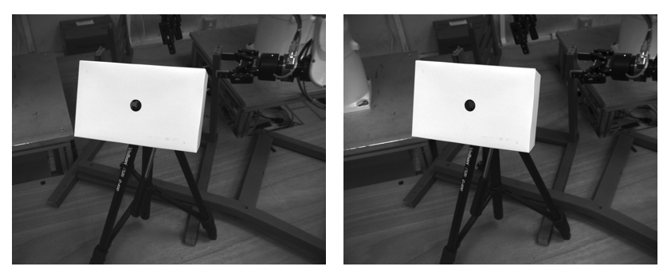



# Object pose estimation from 2D images
Since there is already an [excellent OpenCV tutorial](http://docs.opencv.org/3.0-beta/doc/py_tutorials/py_tutorials.html),
we shall not duplicate the effort here. The reader is advised to go
through the whole tutorial, with particular attention to the following
sections:

1. [Canny edge detection](http://docs.opencv.org/3.0-beta/doc/py_tutorials/py_imgproc/py_canny/py_canny.html#canny);

2. [Contours](http://opencv-python-tutroals.readthedocs.io/en/latest/py_tutorials/py_imgproc/py_contours/py_table_of_contents_contours/py_table_of_contents_contours.html#table-of-content-contours); 

3. [Hough line transform](http://opencv-python-tutroals.readthedocs.io/en/latest/py_tutorials/py_imgproc/py_houghlines/py_houghlines.html#hough-lines);

4. [Feature detection and description](http://opencv-python-tutroals.readthedocs.io/en/latest/py_tutorials/py_feature2d/py_table_of_contents_feature2d/py_table_of_contents_feature2d.html#py-table-of-content-feature2d). 

We shall see now, through an example, how OpenCV can be used in a
robotics setting.

> #### Example::Finding the 3D position of a hole using stereo vision
>Many robotic applications, such as assembly or riveting, require
finding the 3D positions of circular holes. Fig. 26  shows a scene
as captured by a stereo camera. This example demonstrates how to find the
coordinates of the hole in the 2D images and how to subsequently
determine its 3D position.
>


>First, make sure that you have installed
>[OpenCV](../installation/vision.md#installation), [cloned the course repository](../installation/basic_tools.md#git),
>and changed directory to
>$$\texttt{~/catkin_ws/src/osr_course_pkgs/osr_examples/opencv_example/}$$. Define
>the function that finds the center of a hole in an image
>python
``` python
import numpy as np
import cv2
def get_hole_center2d(image):
	image_blur = cv2.blur(image, (5,5))
	image_edges = cv2.Canny(image_blur, 60, 120)
	(thresh, image_bw) = cv2.threshold(image_edges, 80, 255, cv2.THRESH_BINARY+cv2.THRESH_OTSU)
	if image_bw is None:
		return False, None
	image_contours, contours, hierarchy = cv2.findContours(image_bw, cv2.RETR_TREE, cv2.CHAIN_APPROX_SIMPLE)
	image_contours = cv2.cvtColor(image_contours, cv2.COLOR_GRAY2RGB)
	for i,cnt in enumerate(contours):
		if len(np.squeeze(cnt)) > 5:
			rect = np.array(cv2.minAreaRect(cnt))
			(delta_u, delta_v) = rect[1]
			diameter_pixel = max(delta_u,delta_v)
			circularity = delta_u/delta_v if delta_v > delta_u  else delta_v/delta_u
			good_circularity = circularity > 0.8
			good_diameter = diameter_pixel > 30
			if good_circularity and good_diameter:
				cv2.drawContours(image_contours, [cnt], 0, [0,0,255], 2)
				cv2.imwrite('image_contours.png',image_contours)
				return True, rect
	return False, False
limage = cv2.imread('left_image.png', 0)
success, lres = get_hole_center2d(limage)
rimage = cv2.imread('right_image.png', 0)
success, rres = get_hole_center2d(rimage)
```
>
The above code should produce the following file
$$\texttt{image_contours.png}$$ in the current folder.
>

>
Once the hole positions in the left and right camera views have been
detected, one can use the camera information to reconstruct the 3D position by stereo vision. The theory for stereo vision can be found [here](http://docs.opencv.org/2.4/modules/calib3d/doc/camera_calibration_and_3d_reconstruction.html).
>python
``` python
# Load camera info from yaml files
import yaml
left_calib_data = yaml.load( open("left_camera_info.yaml", "r"))
left_cam_matrix = left_calib_data["P"] 
right_calib_data = yaml.load( open("right_camera_info.yaml", "r"))
right_cam_matrix = right_calib_data["P"] 
# Compute projection matrix Q
Tx = right_cam_matrix[3]
fx = right_cam_matrix[0]
B = (-Tx / fx)
lCx = left_cam_matrix[2]
lCy = left_cam_matrix[6]
rCx = right_cam_matrix[2]
rCy = right_cam_matrix[6]
Q = np.zeros((4,4))
Q[0,0] = 1
Q[1,1] = 1
Q[3,2] = 1./B
Q[0,3] = -lCx
Q[1,3] = -lCy
Q[2,3] = fx
Q[3,3] = (rCx-lCx)/B
# Reproject pixel point into 3D coordinates
lhcenter = lres[0]
rhcenter = rres[0]
disparity = lhcenter[0] - rhcenter[0]
XYZ = np.dot(Q, np.array([lhcenter[0], lhcenter[1], disparity, 1]))
XYZ /= XYZ[-1]
print "3D coordinates of the hole: ", XYZ[:3]
```
>
output
```
3D coordinates of the hole:  [-0.22933565 -0.2300843   0.64514768]
```
